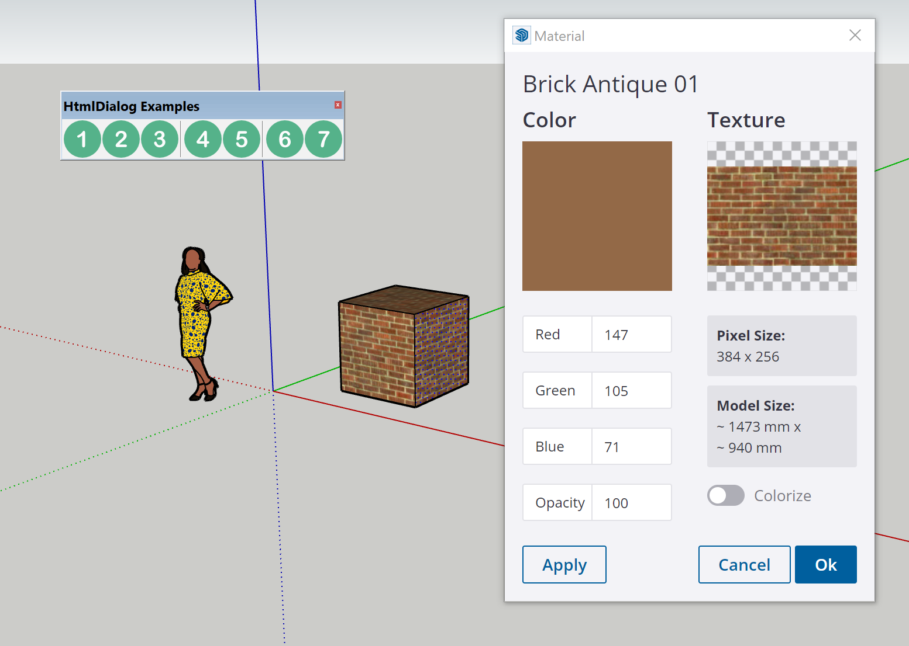

# `UI::HtmlDialog` Examples

These examples were presented at SketchUp DevCamp 2017 in Leeds, UK.

It is split into three parts:
* HtmlDialog class (key difference from WebDialog).
* Communication between Ruby and JS. HTML content synchronization.
* Styling.

Below are some of the notes for each example:

## Step 1

* `UI::HtmlDialog` added in SU2017.
* Key benefit is predictable web-engine.
*   Same Chromium version across platform for each SketchUp version.
* Basic "Hello World".
* Many similar methods from `UI::WebDialog`.
* Some difference in behaviour.
* Some extra visual options.
* Bye skp actions - hello `sketchup` object.
* `get_element_value` is gone - due to Chromium async nature.

## Step 2

* Typical window behaviour - reuse window.
* Bring to front if already visible.
* Note: Different from WebDialog, html and action callbacks doesn't work reused.
* Reason is related to Chromium being in another process. Keeping
  the registered callbacks turned difficult.

## Step 3

* Another pattern for reusing window.
* Register callbacks before showing dialog. Every time.
* If using `set_html`, also do that before showing dialog.

## Step 4

* Syncing data with Ruby, JS and HTML.
* Use frameworks like Vue, React, etc. to bind data.
* Avoids DOM handling.
* Vue is just one of many frameworks, React etc is similar.
* In the template we can display data using `{{ }}`. When the data updates the
  HTML updates automatically.
* For form elements use `v-model` or `v-bind` to bind data properties to the
  template. User interactions is synchronized back to `data`.
* Notice `say_something` make consecutive callbacks and aren't lost as oppose to the old skp-actions.

## Step 5

* Lets create something more realistic.
* Material edit dialog.
* Select entity, display material.
* Pushing data to dialog when it's ready...
  * With Vue, use the `mounted` event.
  * With jQuery, use the `ready` callback.
  * When Ruby get `ready` callback, push data back to dialog.
* We push data by calling JavaScript functions.
* Recommend using JSON for object structures.
* `self.material_to_hash` convert `Sketchup::Material` to a hash with its properties.
* `v-if` conditionally control what to display based on data.
* Opacity is special - data from API is 0.0-1.0, UI use 0-100.
* Computed properties can be used for custom display of data.

## Step 6

* Styling webdialogs.
* Look at UI frameworks; Bootstrap, Foundation, Semantic UI etc.
* We'll use Semantic UI for this example.
* Add reference to semantic UI's CSS and JS libs.
* No Ruby change, we just add some HTML classes to our elements.

## Step 7

* Tweaking layout.
* Using grid system - two eight wide columns (in 16 columns max).
* Some manual CSS adjustments.
* Some padding around content.
* Positioning the footer at the bottom.
* Adjusting the input widths.
* Custom element for color and texture preview.
